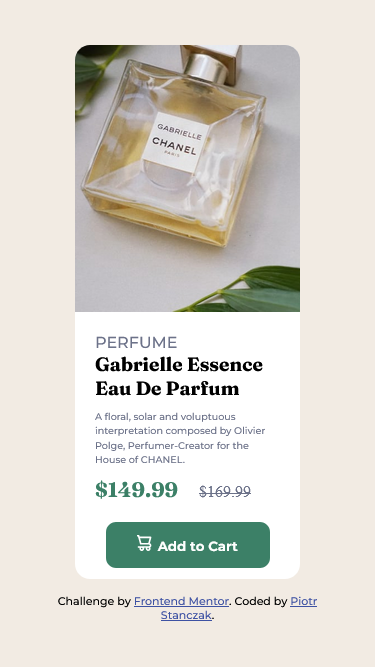

# Frontend Mentor - Product preview card component solution

This is a solution to the [Product preview card component challenge on Frontend Mentor](https://www.frontendmentor.io/challenges/product-preview-card-component-GO7UmttRfa). Frontend Mentor challenges help you improve your coding skills by building realistic projects. Netlify: https://monumental-hamster-38fefb.netlify.app/

## Table of contents

- [Overview](#overview)
  - [The challenge](#the-challenge)
  - [Screenshot](#screenshot)
- [My process](#my-process)
  - [Built with](#built-with)
  - [What I learned](#what-i-learned)
- [Author](#author)

## Overview

### The challenge

Users should be able to:

- View the optimal layout depending on their device's screen size
- See hover and focus states for interactive elements

### Screenshot

### Links

- Solution URL: [GitHub](https://github.com/piotrstanczak94/FrontendMentor---Product-preview-card-component)
- Live Site URL: [Netlify](https://monumental-hamster-38fefb.netlify.app/)

## My process

### Built with

- Semantic HTML5 markup
- SCSS custom properties
- Flexbox
- Mobile-first workflow

### What I learned

I'm still learning basic of HTML, SCSS, Flexbox.

## Author

- Frontend Mentor - [@piotrstanczak94](https://www.frontendmentor.io/profile/piotrstanczak94)
- LinkedIn - [@piotr.andrzej.stanczak](https://www.linkedin.com/in/piotr-andrzej-stanczak/)
